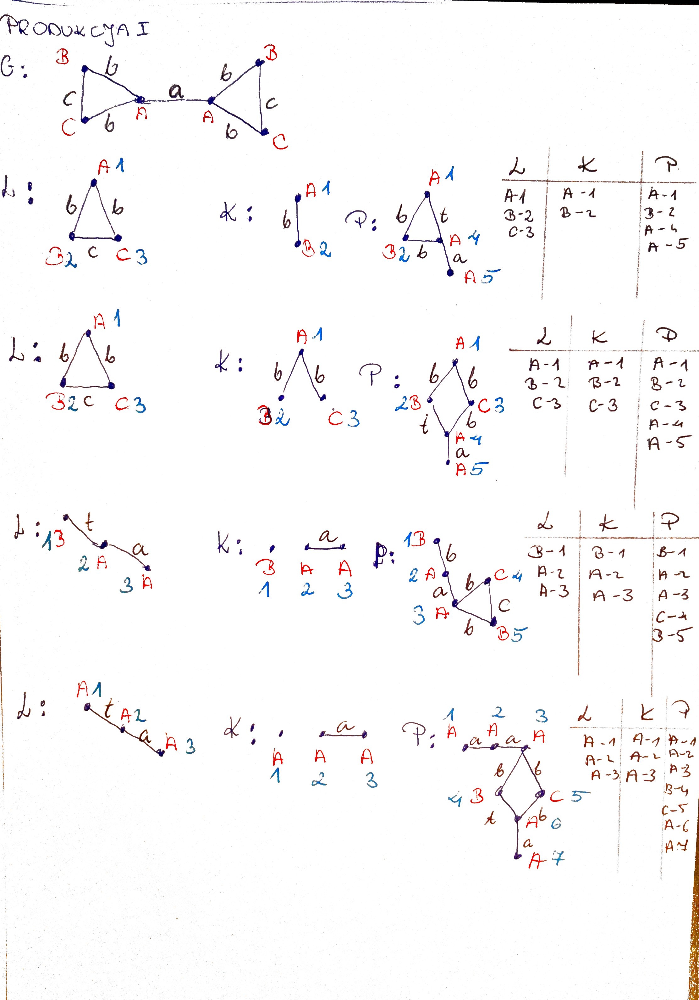
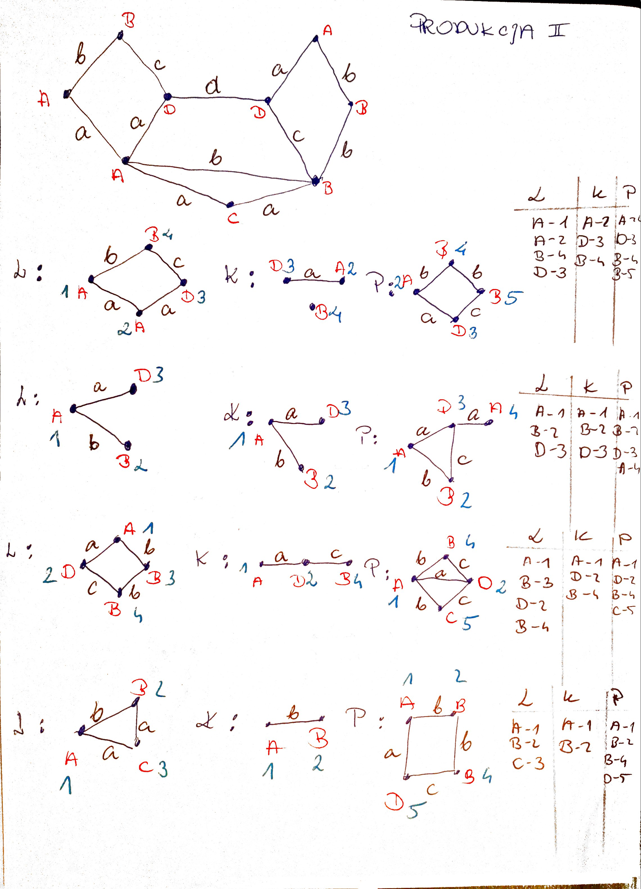
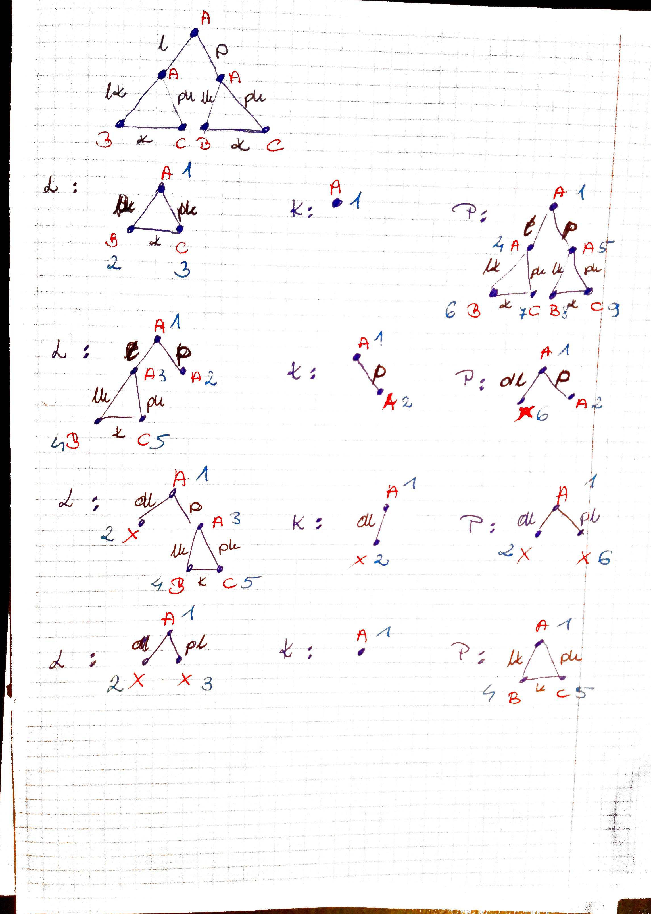
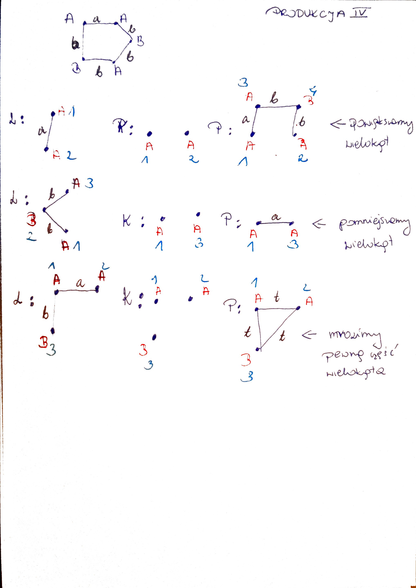

# Double Pushout Graph Rewriting
Project concerning double pushout graph rewriting for Graph Transformations and Graph Algorithms 2021/22.
<br></br>
## Authors
### Antonina Kuś
  - implementation of [double pushout algorithm](src/algorithm.py)
  - implementation of [structures](src/structures.py)
### Dominika Bocheńczyk
  - implementation of [parsing data from files](src/parse.py)
  - preparation of [input files](src/input_files)
### Kamil Miśkowiec 
  - implementation of [graphical user interface](src/gui/gui.py)
### Monika Pyrek
  - preparation of [transformations examples](TiAG-example)
  - preparation of [input files](src/input_files)
### Piotr Magiera
  - implementation of [structures](src/structures.py)
  - project management and content supervision
<br></br>
## User manual
To run the program you should:
- install all packages listed in [requirements file](requirements.txt)
- run the following command
  <br><br/>
  ```
  python main.py
  ```
- provide path to input file in console when asked for it e.g. *src/input_files/ex1.txt*
- the interactive part of the program should be now visible in application window
<br></br>
### Important
One should put indexes of vertices they want to conduct a production on:
- in the order corresponding to indexes of vertices in the left hand side of the production in ascending order
- separated with commas

[Example of a proper input to a production](use_example.jpg)
<br></br>
## Input file format
[Example of an input file](src/input_files/ex1.txt)
<br></br>
File:
- Input Graph
- Productions
- NEWLINE AT THE END
<br></br>
where:
  - Graph:
    - -->
    - labels
    - indexes
    - edges in format:
    - vi edge_label vj
    - --<

  - Production:
    - Graph
    - Graph
    - Graph
<br></br>
## Models of transformations
Project files contain four example graph grammars concerning graph transformations.
<p align="center">
  
  
  <br /> 
</p>
<p align="center">
  
  
  <br /> 
</p>
